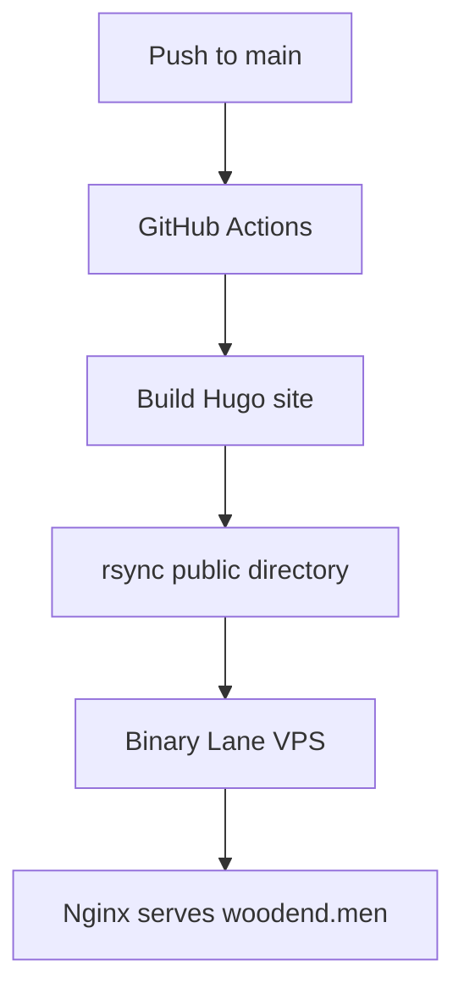

# Deployment

This site builds with Hugo and deploys the generated `public/` directory to the Binary Lane VPS over SSH using GitHub Actions.

## Deployment model



## DNS

Create DNS records for the VPS public IP address:

| Type | Name | Value |
| --- | --- | --- |
| `A` | `@` | VPS IPv4 address |
| `AAAA` | `@` | VPS IPv6 address, if enabled |
| `CNAME` | `www` | `woodend.men` |

## VPS setup

The deployment user should not be `root`. It only needs write access to the web root.

Example Ubuntu setup:

```sh
sudo apt update
sudo apt install nginx rsync certbot python3-certbot-nginx
sudo adduser --disabled-password --gecos '' deploy
sudo mkdir -p /var/www/woodend.men
sudo chown deploy:www-data /var/www/woodend.men
sudo chmod 2755 /var/www/woodend.men
```

Create `/etc/nginx/sites-available/woodend.men`:

```nginx
server {
    listen 80;
    listen [::]:80;
    server_name woodend.men www.woodend.men;

    root /var/www/woodend.men;
    index index.html;

    location / {
        try_files $uri $uri/ =404;
    }
}
```

Enable and test the site:

```sh
sudo ln -s /etc/nginx/sites-available/woodend.men /etc/nginx/sites-enabled/woodend.men
sudo nginx -t
sudo systemctl reload nginx
```

After DNS resolves to the VPS, enable HTTPS:

```sh
sudo certbot --nginx -d woodend.men -d www.woodend.men
```

## SSH key setup

Create a dedicated deploy key on a trusted local machine:

```sh
ssh-keygen -t ed25519 -C 'github-actions-woodend-men' -f ./woodend-men-deploy
```

Install the public key for the `deploy` user on the VPS:

```sh
sudo mkdir -p /home/deploy/.ssh
sudo chmod 700 /home/deploy/.ssh
sudo tee -a /home/deploy/.ssh/authorized_keys < ./woodend-men-deploy.pub
sudo chmod 600 /home/deploy/.ssh/authorized_keys
sudo chown -R deploy:deploy /home/deploy/.ssh
```

## GitHub secrets

Add these repository secrets in GitHub:

| Secret | Example | Notes |
| --- | --- | --- |
| `DEPLOY_HOST` | `woodend.men` | VPS hostname or IP address |
| `DEPLOY_USER` | `deploy` | Unprivileged deployment user |
| `DEPLOY_SSH_KEY` | Private key contents | Contents of `woodend-men-deploy` |
| `DEPLOY_KNOWN_HOSTS` | Host key line | Pin the VPS SSH host key |
| `DEPLOY_PATH` | `/var/www/woodend.men` | Web root on the VPS |
| `DEPLOY_PORT` | `22` | Optional if using port 22 |

Populate `DEPLOY_KNOWN_HOSTS` from a trusted network and verify it against the VPS console or Binary Lane control panel before saving it:

```sh
ssh-keyscan -p 22 woodend.men
```

## Manual deploy test

After running a local Hugo build, the same deployment script can be used manually:

```sh
hugo --minify --cleanDestinationDir
DEPLOY_HOST='woodend.men' DEPLOY_USER='deploy' DEPLOY_PATH='/var/www/woodend.men' DEPLOY_PORT='22' DEPLOY_KNOWN_HOSTS='host-key-line' bash scripts/deploy-via-rsync
```

## Security notes

- Use a dedicated `deploy` user with no sudo access
- Do not store the SSH private key in the repository
- Keep `DEPLOY_KNOWN_HOSTS` pinned to reduce man-in-the-middle risk
- Restrict the VPS firewall to SSH, HTTP, and HTTPS unless other services are required
- Enable HTTPS with Certbot before sending users to the site
- The site avoids third-party JavaScript and tracking by default
